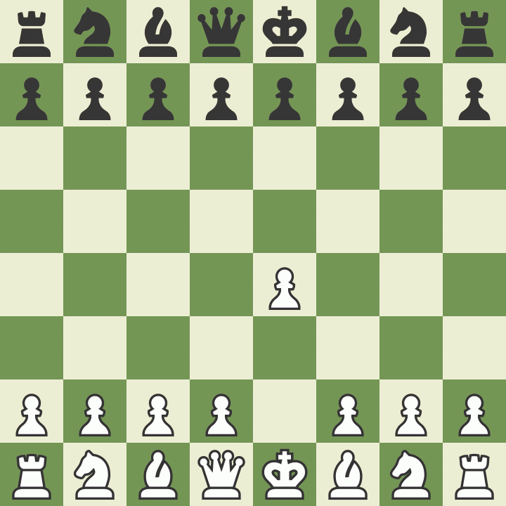

# chess-bot

A CLI based chess game against an AI that uses alpha-beta pruning to generate the best moveset

To play against the bot, clone the repository and run the following in the repository root:

```
$ python ./main.py
```

To make a move, type the start position of the piece, and then its end position. Example, to move the king pawn, type `e2 e4`, whereas to move the king side knight you can type `g1 f3`, and so on...

## Comparison
The chess bot plays at a 700-1000ELO rating and is well-suited for fast paced games such as bullet chess. The following are examples of it playing against various bots on chess.com

### Against 400ELO


### Against 1000ELO


### Against 250ELO

